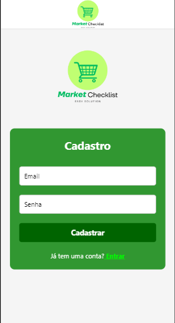
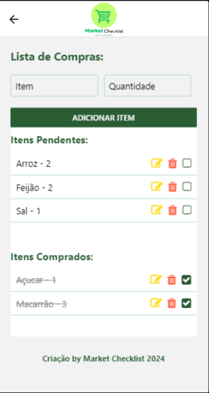

# Market Checklist ( Lista de compras )

## O que é o Market Checklist?

Market Checklist é uma aplicação mobile inovadora, desenvolvido para simplificar e organizar o processo de compras de supermercado. Concebido para oferecer uma solução digital prática, o Market Checklist permite que os usuários criem, gerenciem e mantenham suas listas de compras de maneira eficiente e sem complicações.

Com o Market Checklist, os usuários podem adicionar itens às suas listas de compras, editar as informações dos itens existentes, marcar itens como comprados e remover itens que não são mais necessários. A aplicação é equipada com uma interface simples, projetada para proporcionar uma experiência de usuário agradável.

Além das funcionalidades básicas de gerenciamento de listas, o Market Checklist utiliza o AsyncStorage para garantir que todas as informações inseridas pelos usuários sejam armazenadas de forma persistente, mesmo após o fechamento do aplicativo. Isso significa que os usuários não precisam se preocupar em perder suas listas de compras ao reiniciar o aplicativo.

Outro destaque do Market Checklist é seu design responsivo, que se adapta perfeitamente a diferentes tamanhos de tela, oferecendo uma experiência de uso consistente em smartphones e tablets. Os ícones e botões claros facilitam a navegação e a realização de ações dentro do aplicativo.

Em resumo, o Market Checklist é uma ferramenta essencial para qualquer pessoa que deseja otimizar suas compras de supermercado, economizando tempo e reduzindo o estresse associado ao processo de compras. O Market Checklist se destaca como uma solução moderna e eficaz para o gerenciamento de listas de compras. Chega de perder tempo fazendo sua lista em papel.

## Telas

<div style="display: flex; justify-content: space-around;">
  
  
  
</div>


# Funcionalidades

- **Adicionar Item**: Permite ao usuário adicionar novos itens à lista de compras, especificando o nome do item e a quantidade.

- **Editar Item**: Possibilita a edição de itens já existentes na lista, permitindo que o usuário atualize o nome e a quantidade.

- **Excluir Item**: O usuário pode remover itens da lista de compras.

- **Marcar como Comprado**: Os itens podem ser marcados como comprados, facilitando o controle durante as compras

- **Armazenamento Persistente**: Utiliza armazenamento local (AsyncStorage) para garantir que a lista de compras esteja sempre disponível, mesmo após fechar o aplicativo.

- **Interface simples**: Interface fácil de usar com ícones e botões claros para cada ação.

- **Responsividade**: Adaptado para diferentes tamanhos de tela, garantindo uma boa experiência tanto em smartphones quanto em tablets.

## Stack utilizada

**React Native:** Framework para desenvolvimento de aplicativos móveis multiplataforma.

**AsyncStorage:** Biblioteca para armazenamento de dados no dispositivo móvel.

**React-native-vector-icons:** Biblioteca para utilização de ícones no aplicativo.

**Yarn:** Gerenciador de dependências.

**Canva:** Ferramenta utilizada para criação do logotipo do aplicativo.

**VSCode:** Editor de código utilizado para o desenvolvimento.

# Estrutura de pastas
```

MarketChecklist/
├── node_modules/
├── assets/
│      └── logo.png
├── src/
│      ├── pages/
|          |──  Login.js
│          └──  Home.js
├── .gitignore
├── App.js     
├── babel.config.js
├── eas.json
├── package-lock.json 
├── package.json
└── yarn.lock
```

# Sessões do Aplicativo

- **Login.js:**

   - Tela onde realiza seu cadastro, ou se ja houver um cadastro você apenas ira ter que fazer o login.

- **Home.js:**

   - Componente principal onde todas as funcionalidades de adicionar, editar, excluir e marcar itens como comprados são implementadas, juntamente com um botão para salvar as alterações.

- **App.js:** 

   - Componente raiz que encapsula o aplicativo.

- **Footer:**

   - Exibe a mensagem "Criação by Carla Coder 2024" no final da tela, tanto na web quanto no mobile.

   
# Documentação

- **React Native Documentation:** https://reactnative.dev/docs/getting-started

- **AsyncStorage Documentation:** https://react-native-async-storage.github.io/async-storage/docs/install/

## Como Executar o Projeto

- Pré-requisitos:

  - Node.js
  - Yarn
  - Android 

- Clonar o Repositório:

```
git clone https://github.com/seu-usuario/MarketChecklist.git

```

- Abrir com VSCode

- Instale as dependências

```
yarn install

```

- Entre na pasta raiz de seu projeto

```
cd MarketChecklist

```

- Instale a biblioteca de ícones

```
npm install react-native-vector-icons

```

- Importe os ícones necessários em seu código:

```
import React, { useState, useEffect } from 'react';
import { View, Text, TextInput, Button, FlatList, StyleSheet, TouchableOpacity, Dimensions, ScrollView } from 'react-native';
import AsyncStorage from '@react-native-async-storage/async-storage';
import Icon from 'react-native-vector-icons/FontAwesome'; 
```

- Inicie o servidor

```
yarn start

```

# Como gerar o APK

- Vamos agora transformar o projeto em realidade. Para isso vamos precisar de algumas ferramentas

- Primeiramente crie uma conta neste site: https://expo.dev

- Para gerar um APK local com o novo EAS do Expo: Instale o eas-cli de forma Global via npm (o Expo não recomenda o uso do Yarn para pacotes globais😪)

```
npm install -g eas-cli
```

- Faça o login na sua conta Expo

```
eas login
```

- Gere o arquivo de configuração (eas.json)

```
eas build:configure
```

- Substitua o arquivo gerado pelo conteúdo abaixo:

```
{
  "build": {
    "preview": {
      "android": {
        "buildType": "apk"
      }
    },
    "preview2": {
      "android": {
        "gradleCommand": ":app:assembleRelease"
      }
    },
    "preview3": {
      "developmentClient": true
    },
    "production": {}
  }
}

```

- Gere o APK

```
eas build -p android --profile preview
```

- Caso faça alguma alteração no código fonte, basta repetir o passo 5 para gerar e fazer o dowload novamente do APK.


## Criadoras do Projeto

- Este projeto foi criado por Carla Coder e Leticia Hofman. Carla e Leticia são desenvolvedoras de software adquirindo experiência em diversas tecnologias e atualmente focada no desenvolvimento de aplicações mobile e web.
- Criamos este aplicativo para facilitar seu dia a dia como dona de casa. Quem sabe ela consiga facilitar a sua vida também. Experimente o aplicativo e depois me conte.

- [@octokatherine - Carla](https://www.github.com/Carla-coder)
- [@octokatherine - Leticia](https://www.github.com/lehhofman)

